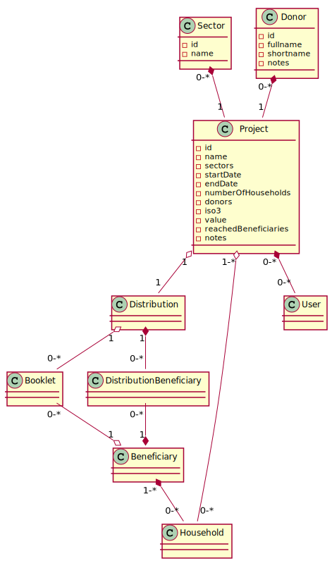

# Models

## General

In this project, models are all extending the same class "CustomModel". A custom model contains functions to translate data from the Api to the Front and vice versa, and fields which can be displayed/edited in the tables, modals etc. A CustomModel also contains a title to be displayed in its tab, a matSortActive to pre-select the ordered column, and rights, to know who will be able to modify it.

The different information about the fields (the values, the dropdown options etc), can be fetched/set with the getters and setters defined in the Model.

The function getDateOffset will be used to initialize a value at a certain Date.

The identifyingName will be used to complete sentences in the modals. Its default value is the name of the class. For example, in the modal to delete a distribution:
* Code: "You are about to delete _identifyingName_. Are you sure?"
* Default: "You are about to delete this distribution. Are you sure?"
* Distribution name: "You are about to delete Battambang-19-05-2020. Are you sure?"

Thanks to this principle (every model extending the exact same class), it becomes possible to generalize the displaying of tables and modals for every possible entity. However, each field in a class has its own way of being displayed or modified, this is why we created mutliple types of CustomModelFields to manage inputs, selects, checkboxes etc.

## CustomModelFields

Every custom model field will have the general properties of the abstract class and its own particular properties.

### General properties

__value__: The value of the field, to be displayed in the table/modal

__title__: The title of the associated column

__kindOfField__: This will identify the fields so the modal/table can know how to handle it

__isDisplayedIn***__: Specifies where to display the field (Table, Modal or Summary)

__isImageInTable__: Some fields, as Sectors or Commodities, are displayed as little icons in the different tables

__isRequired__: Setting this property to true will automatically make modal forms invalid in the absence of the field

__isSettable/isEditable__: Whether we can set/modify it or not

__nullValue__: The string to be displayed if the field is empty ('none' by default)

__hint__: The text to be displayed under the input

__pattern__: The pattern to be respected by the input

__patternError__: The error to be displayed if this pattern is not respected

__isTrigger__: Whether a change in the input must trigger a function or not

__triggerFunction__: The function triggered on input change

__filterName__: If used as a filter for the backend, the filterName is the key sent to the api

### Specific properties

__maxSelectionLength__: For a multipleSelect, specify the maximum number of items that can be selected

__bindField__: For a select, the field to display in the dropdown (usually the name of the entity)

__apiLabel__: For a select or a nestedField, the field sent back to the api (usually the id of the entity) to identify the item selected

__options__: For a select, the list of options in the dropdown

__numberOfInput__: For an array of inputs, the number of inputs to display

__displayTime__: For a date field, whether we display the date as _"dd-mm-yyyy hh:mm"_ or _"dd-mm-yyyy"_

__uploadPath__: For an input of type file, the path to the api where to upload this file

__fileUrlField__: For a field of type file, the url to the image/document

__display***Function__: The way to display a complex field in a Modal/Table

__childrenObject__: For a nestedField, from which field do we need to extract the information

__childrenFieldName__: For a nestedField, the name of the field in the childrenObject

(For the two properties above, for example, the field "givenName" of a transaction will be the childrenFieldName "givenName" of the field "Beneficiary" of the transaction)

__isPassword__: Whether or not it is a password and therefore must be hidden when typed

__isLongText__: Whether the input must be a textarea or a simple input type="text"

# Relationships between models

## At the center of the structure: project

The project is the biggest entity possible in the code. It contains distributions and can be assigned to users. The "value" field now is used to give the number of targeted beneficiaries by the project.

## Sharing resources fairly: distribution

A Distribution is a way to share commodities (Food, cash, vouchers etc.) in a certain place at a certain time, according to some vulnerability criteria. A distribution contains beneficiaries, targetting them individually or as members of a household (precised by the "type" field, as a DistributionType). The threshold corresponds to the minimum selection score a beneficiary must reach to be a part of the distribution. This score is calculated with the weight of each selection criteria.

A criteria contains a field (eg: "Date of Birth"), a condition (eg: ">") and a value (eg: 12-03-1996), and it applies to a kindOfBeneficiary (individual or household).

## Beneficiaries in the same family: household

A household is a group of beneficiaries, and contains some usefull common information as an address, location, livelihood, number of dependents or the answers to some country specific questions. The vulnerabilities of the household is the sum of the vulnerabilities of its members. A householdFilters model was also created to be able to filter the very large list of households in the table.

Note that a location contains until four different administrations, from the less precise to the more precise. For example, adm1 can be a province and adm4 a village in this province.

## Individual information: beneficiary

A household member can have its own personnal information, different from the other members (the first name, date of birth, phone, ID etc.). The beneficiaryStatus defines whether or not the beneficiary is the head of the household. The residencyStatus precises whether the beneficiary is a refugee, a resident or an IDP. Note that the field NationalIds can contains many IDs but for the moment it always contains only one.

## A specific way of distributing: booklet

A booklet is a group of vouchers, to be used in shops in order to buy food, hygienic products etc. The booklet is identified by a code, which will be converted to a QR Code later on. The same principle applies to the vouchers. The booklet's vouchers can have different values but they have the same currency, and the booklet's date of use is either null if one voucher is still unused, either equal to the date of use of the last used voucher. The booklet's value is the sum of the vouchers' values.

Note that the booklet's password is optional, and the boolean field 'define password' allows the user to chose whether or not to define one.

## Distributing IRL: transaction

On the field, the distributions will be executed by transactions. There are three types of transactions:

* Cash will be sent programatically with a button
* General goods such as food or kits will be distributed on the field and their status will be updated manually
* Vouchers will be printed and assigned manually

Every transaction will be familiarly associated with its beneficiary, that's why we will talk about the transaction's "familyName" or "phones".

## Managing the platform: user

There are two types of users in the platform: the vendors, who will use the app to sell goods in exchange for vouchers, and the "web users", the users who take care of the organisation on the web application.

Note that a web user (i.e. the users not associated with vendors) won't be able to login into the app and vice versa.

A user will have a role (admin, project manager, country manager) and depending on this role, can be assigned different countries or projects. Those parameters will define what the user can see, create, modify or delete on the platform.

Note that a user can have a preferred language, used automatically when they log in, but can also change the language manually on the platform.

# An abstract service to rule them all: CustomModelService

While every class extends the CustomModel, every service extends the CustomModelService, which provides the commonly used functions (get, create, update, delete).
The __makeUrl()__ function will be used to concatenate the base of the api url and the specific path used for each service and called "CustomModelPath" (eg: "distributions").
